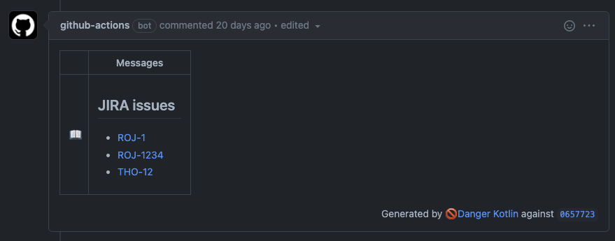

# danger-kotlin-jira


This plugin will collect JIRA issues mentioned in a PR (e.g. ROJ-1234) and display them as a hyperlinked Danger message.



## Getting started

1. Add the following dependency at the top of your kts Dangerfile

```kotlin
@file:DependsOn("com.rojanthomas:danger-kotlin-jira:x.y.z")
```

2. Register the plugin in your kts Dangerfile (this must be after the dependency declaration).

```kotlin
register plugin JiraPlugin
```

3. Invoke JiraPlugin.check(...), passing in the `jiraUrl`, which `projectKeys` to look for & which `sources` to check `projectKeys` for. You can provide any number of `projectKeys` or `sources`.

```kotlin
danger(args) {
    JiraPlugin.check(
        jiraUrl = "https://rojanthomas.atlassian.net/browse/",
        projectKeys = listOf("ROJ", "THO"),
        sources = listOf(
            this.github.pullRequest.title,
            this.github.pullRequest.body,
        )
    )
}
```